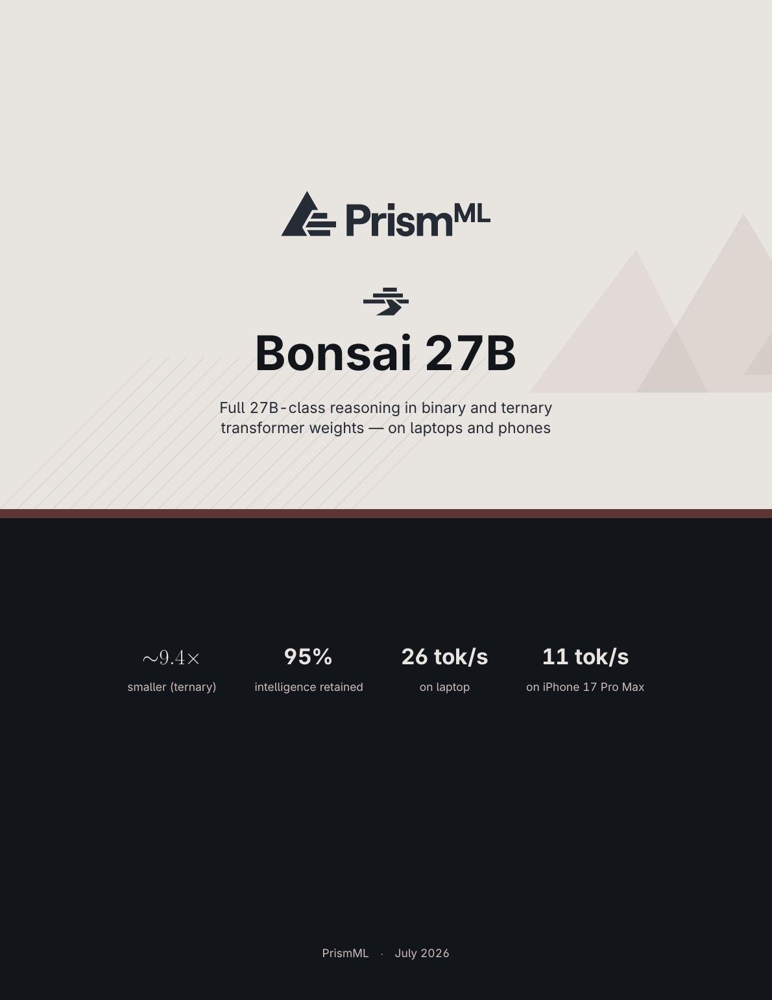
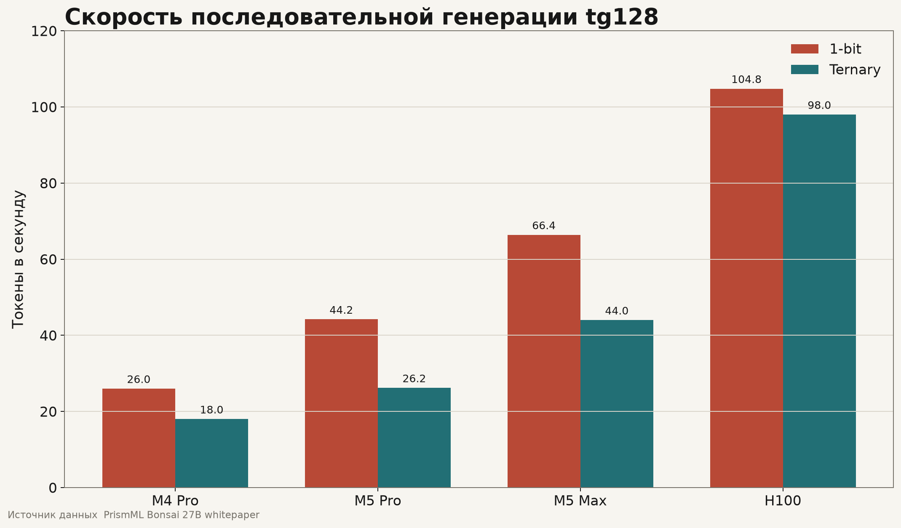
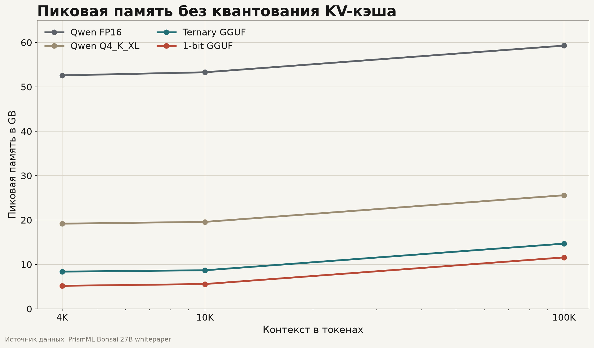
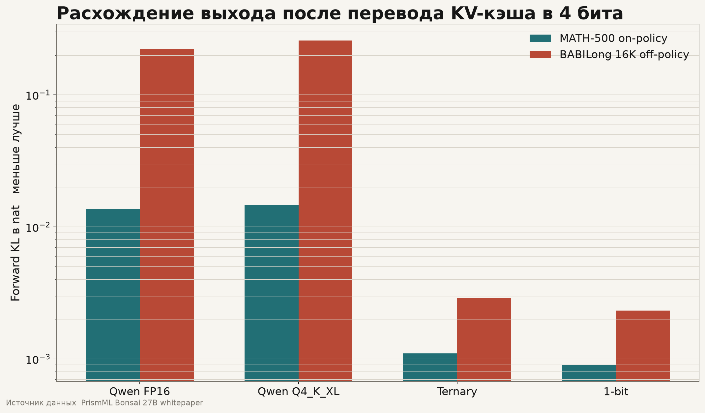
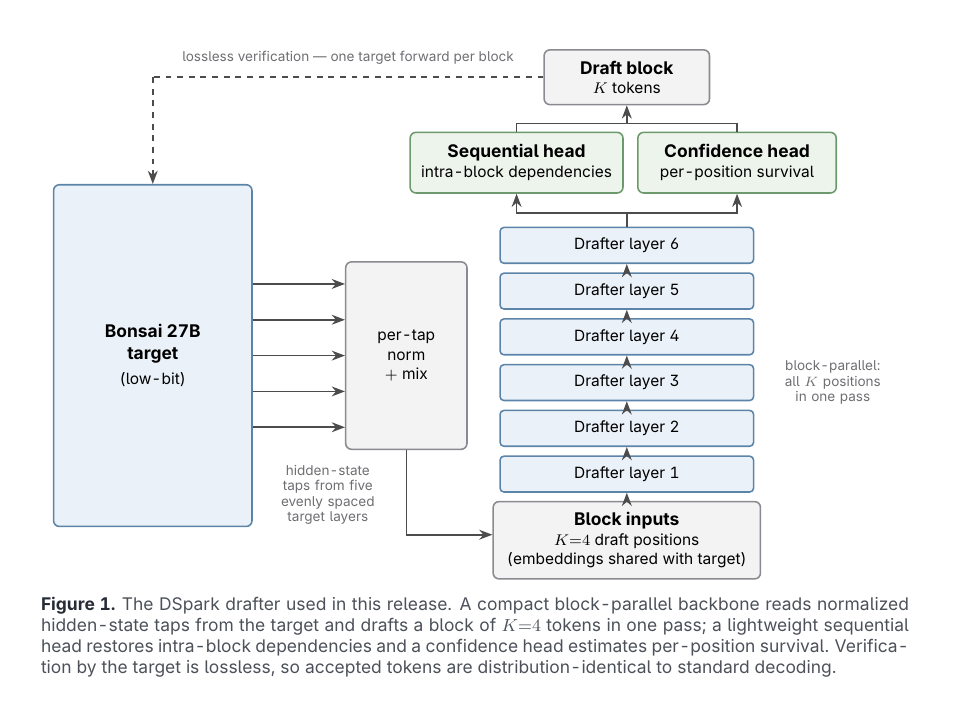
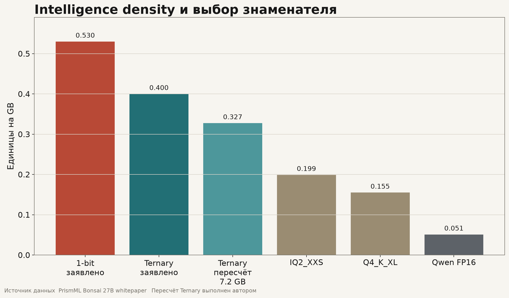

# Bonsai 27B и пределы экстремального сжатия

Технический разбор бинарной и тернарной версий PrismML

Версия от 17 июля 2026 года

Эта статья продолжает мой [Telegram-пост о Bonsai 27B](https://t.me/nksvilya/54). В посте я сознательно использовал несколько упрощений. Здесь я проверяю эти допущения по [официальному whitepaper Bonsai 27B](https://github.com/PrismML-Eng/Bonsai-demo/blob/main/bonsai-27b-whitepaper.pdf), model cards и опубликованным весам

## Краткий вывод

Bonsai 27B является преобразованной версией [Qwen3.6-27B](https://huggingface.co/Qwen/Qwen3.6-27B). Архитектура языковой модели сохранена. Большие матрицы embeddings, attention projections, MLP projections и LM head переведены в бинарное или тернарное представление. На каждые 128 дискретных значений хранится один FP16-коэффициент масштаба. Нормализации, scale metadata, активации, attention operations и чувствительные накопления сохраняют более высокую точность. Vision tower использует HQQ 4-bit. KV-кэш может использовать отдельную 4-битную квантизацию.

## Исходная модель

> «Для простоты нашего понимания скажу вот что, веса = параметры»
>
> [Исходный Telegram-пост](https://t.me/nksvilya/54)

Согласно [model card Qwen3.6-27B](https://huggingface.co/Qwen/Qwen3.6-27B/blob/main/README.md), языковая часть содержит 64 слоя и скрытую размерность 5120. Слои организованы в 16 повторяющихся групп. Каждая группа содержит три слоя Gated DeltaNet и один слой Gated Attention. Получается 48 linear-attention слоёв и 16 full-attention слоёв. Нативный контекст равен 262 144 токенам.

Whitepaper PrismML приводит следующую декомпозицию модели.

| Компонент | Объём |
|---|---:|
| Языковой backbone | около 24,8 млрд весов |
| Embeddings и LM head | около 2,5 млрд весов |
| Vision tower | около 0,46 млрд параметров |
| Transformer blocks | 64 |
| Vision blocks | 27 |

Термин 27B относится к классу модели и округлённому числу параметров. Embeddings, attention projections, MLP projections и LM head сами являются матрицами весов. В упрощённой формулировке из Telegram-поста веса можно считать параметрами. В техническом тексте параметры охватывают все обучаемые скаляры. KV-кэш и активации к параметрам не относятся. Они возникают во время исполнения.

Большее число параметров увеличивает потенциальную ёмкость модели. Оно не является прямой мерой знаний. Итоговая способность зависит от данных, цели обучения, архитектуры, post-training и inference setup.

> «Чем больше весов, тем больше информации и сложных закономерностей модель потенциально способна усвоить»
>
> [Исходный Telegram-пост](https://t.me/nksvilya/54)

Слово `потенциально` делает тезис допустимым. Для технического текста я заменяю информацию на representational capacity и связываю её с training process.

## Что PrismML называет преобразованием представления

> «Они научились ещё на этапе дообучения закладывать в модель то, что она будет работать в режиме экстремального сжатия»
>
> [Исходный Telegram-пост](https://t.me/nksvilya/54)

Whitepaper сообщает о `representation transformation`, которое отображает предобученную FP16-модель в бинарное или тернарное пространство с сохранением поведения. Архитектура остаётся неизменной. Ранний [whitepaper 1-bit Bonsai 8B](https://github.com/PrismML-Eng/Bonsai-demo/blob/main/1-bit-bonsai-8b-whitepaper.pdf) прямо связывает основу метода с proprietary Caltech intellectual property. [Whitepaper Ternary Bonsai](https://github.com/PrismML-Eng/Bonsai-demo/blob/main/ternary-bonsai-8b-whitepaper.pdf) описывает тот же формат на моделях 1,7B, 4B и 8B.

Публичные материалы позволяют установить следующие факты.

- PrismML начинает с готовой Qwen3.6-27B
- архитектура не изменяется
- крупные языковые матрицы получают низкобитное представление end to end
- модель исполняется специализированными kernels без разворачивания всего тензора весов в FP16
- компания сообщает об обучении на Google TPU v5 в [официальном объявлении](https://prismml.com/news/prismml-releases-bonsai-27b)

Публичные материалы не позволяют установить следующие детали.

- способ первоначального назначения бинарных или тернарных кодов
- формулу основной training loss
- наличие knowledge distillation
- наличие quantization-aware training в привычном смысле
- calibration dataset
- объём post-training данных
- optimizer и learning-rate schedule
- число шагов и TPU-hours
- критерий выбора размера группы 128

Фраза из Telegram-поста о закладывании экстремального сжатия на этапе дообучения выглядит правдоподобно на уровне общей идеи. Whitepaper не подтверждает конкретную схему. Формулировка о компенсации на уровне архитектуры требует исправления. Архитектура сохранена. Официально подтверждены преобразование представления, настройка весов и runtime stack.

## Бинарные и тернарные веса

> «В бинарной Bonsai каждый основной вес может принимать одно из двух значений −1 или +1, а в тернарной добавляется третье значение 0»
>
> [Исходный Telegram-пост](https://t.me/nksvilya/54)

Для бинарной версии каждый код принимает значение из множества

$$
b_i \in \{-1,+1\}
$$

Восстановленный вес вычисляется по формуле

$$
w_i=s_g b_i
$$

Для тернарной версии код принимает значение из множества

$$
t_i \in \{-1,0,+1\}
$$

Восстановленный вес вычисляется по формуле

$$
w_i=s_g t_i
$$

Индекс $g$ обозначает группу из 128 весов. Значение $s_g$ хранится в FP16 и используется всей группой.

Бинарный код занимает один бит. Один FP16-scale добавляет 16 бит на группу. Амортизированная стоимость равна

$$
b_{binary}=1+\frac{16}{128}=1.125
$$

Тернарное значение несёт $\log_2 3$ бита информации. Амортизированная стоимость равна

$$
b_{ternary}=\log_2 3+\frac{16}{128}\approx1.71
$$

Эти вычисления объясняют заявленные коэффициенты 14,2 раза и 9,4 раза относительно FP16.

## Что делает коэффициент масштаба

> «для каждой их группы добавляя отдельный коэффициент масштаба и для 128 весов модели Bonsai-27b он свой»
>
> [Исходный Telegram-пост](https://t.me/nksvilya/54)

Scale восстанавливает локальный диапазон величин. Без него бинарная группа содержала бы только числа −1 и +1. Со scale она содержит −$s_g$ и +$s_g$. Тернарная группа получает −$s_g$, 0 и +$s_g$.

Простой вывод показывает роль scale. Пусть исходные FP16-веса группы обозначены $w_i^*$. Для заранее выбранных бинарных знаков минимизация квадратичной ошибки имеет вид

$$
\min_s \sum_i (w_i^*-s b_i)^2
$$

Решение для фиксированных кодов равно

$$
s=\frac{\sum_i w_i^*b_i}{\sum_i b_i^2}
$$

Если $b_i=sign(w_i^*)$, знаменатель равен числу весов, а scale становится средним модулем весов группы.

$$
s=\frac{1}{n}\sum_i |w_i^*|
$$

Для фиксированных тернарных кодов получается аналогичное выражение.

$$
s=\frac{\sum_i w_i^*t_i}{\sum_i t_i^2}
$$

Эти формулы являются общим выводом для group-wise quantization. Они не описывают закрытый алгоритм PrismML. Они показывают, почему один scale уменьшает ошибку. Группа сохраняет типичную локальную величину весов. Знаки сохраняют направление вклада. Нулевое тернарное состояние позволяет удалить малые или неудобные для приближения значения.

Scale не восстанавливает индивидуальные FP16-веса. Все положительные бинарные веса одной группы получают одну величину. Все отрицательные веса получают противоположную величину. Основная неопределённость состоит в выборе кодов и в адаптации остальной сети к дискретным ограничениям. Эта часть относится к закрытому transformation method.

Размер группы 128 задаёт компромисс между локальностью и metadata overhead. Более короткая группа точнее следует локальной статистике и требует больше scale values. Более длинная группа уменьшает metadata overhead и заставляет больше весов делить одну величину. Для g128 стоимость scale составляет 0,125 бита на вес.

## Идеальный размер и фактический файл

> «3,9 и 7,2 ГБ против исходных 54 ГБ»
>
> [Исходный Telegram-пост](https://t.me/nksvilya/54)

Whitepaper использует два определения размера.

| Представление | Эффективные биты на вес | Идеальный размер | Фактический GGUF |
|---|---:|---:|---:|
| FP16 | 16 | около 54 ГБ | около 54 ГБ |
| Ternary g128 | 1,71 | около 5,9 ГБ | около 7,17 ГБ |
| Binary g128 | 1,125 | около 3,9 ГБ | около 3,9 ГБ |

Разница у тернарной версии возникает из-за текущего packing. Три состояния требуют $\log_2 3$ бита на уровне информации. Практический kernel хранит каждое значение в двухбитном слоте. Вместе со scale получается 2,125 бита на вес. Поэтому формулировка 5,9 ГБ описывает информационный и native target. Скачиваемый файл `Ternary-Bonsai-27B-Q2_0.gguf` занимает около 7,2 ГБ. В исходном Telegram-посте я использовал фактический размер файла.

MLX-пакеты имеют дополнительный overhead. Опубликованный бинарный pack занимает 5,13 ГБ. Тернарный pack занимает 8,49 ГБ. В них vision tower включён в общий файл. MLX хранит scale и bias для каждой группы. PrismML кодирует scale-only представление через $s_{mlx}=2s_g$ и $b_{mlx}=-s_g$. Восстановленные бинарные значения остаются равными ±$s_g$. Второй FP16-параметр увеличивает контейнерный размер.

## Какие части остаются в высокой точности

> «столь ужатую точность имеют не все компоненты модели, часть всё равно будет иметь полную точность»
>
> [Исходный Telegram-пост](https://t.me/nksvilya/54)

Фраза `1-bit model` относится к крупным матрицам языковой сети. Полный inference graph не состоит из однобитных операций.

| Часть системы | Представление |
|---|---|
| Embeddings | binary или ternary g128 |
| Attention projections | binary или ternary g128 |
| MLP projections | binary или ternary g128 |
| LM head | binary или ternary g128 |
| Normalization parameters | более высокая точность |
| Group scales | FP16 |
| Activations | более высокая точность |
| Attention operations | более высокая точность |
| Accumulation-sensitive stages | более высокая точность |
| Vision tower | HQQ 4-bit |
| KV-кэш | FP16 или отдельный 4-bit режим |
| DSpark drafter | Q4_1 в компактной поставке |

Whitepaper подчёркивает отсутствие крупных высокоточных language-weight tensors внутри embeddings, attention projections, MLP projections и LM head. Это содержательное значение выражения end to end в материалах PrismML. Оно не означает однобитные активации или однобитную арифметику всей модели.

Vision tower поставляется отдельным файлом размером около 0,63 ГБ в HQQ 4-bit. Контейнер обозначен Q8_0 и хранит HQQ-представление в удобной для runtime упаковке. BF16 fallback занимает около 0,93 ГБ. Vision tower загружается для обработки изображений и не входит в постоянный text-only resident set.

## Почему runtime является частью результата

Сжатый checkpoint имеет практическую ценность после появления прямого исполнения. Ядра PrismML читают packed codes, применяют FP16-scale внутри fused matrix multiplication и не создают полный FP16-тензор весов в памяти.

При последовательной генерации каждого токена устройство считывает почти весь набор весов. Batch size 1 создаёт низкую arithmetic intensity. Скорость decode определяется пропускной способностью памяти и объёмом данных на шаг. Уменьшение checkpoint сокращает memory traffic для каждого токена.

Prompt processing имеет другую нагрузку. Сразу обрабатывается множество входных токенов. Одни и те же веса используются для большего числа операций. Этап prefill сильнее зависит от вычислительной производительности. Поэтому Bonsai показывает наиболее заметный эффект на token generation.

В whitepaper приведены измерения `tg128` и `pp512` при batch size 1 без vision tower и drafter. Binary Bonsai достигает 26,0 токена в секунду на M4 Pro, 44,2 на M5 Pro, 66,4 на M5 Max и 104,8 на H100. Ternary Bonsai достигает 18,0, 26,2, 44,0 и 98,0 токена в секунду на тех же платформах. iPhone 17 Pro Max получил 11,0 токена в секунду с бинарной MLX Swift версией.

Сходная скорость binary и ternary на H100 показывает границу bandwidth argument. Batch size 1 на таком GPU сильнее зависит от kernel launch и synchronization latency. Разница в размере весов не превращается в пропорциональную разницу throughput.

## Hybrid attention и память контекста

Qwen3.6-27B содержит growing full-attention KV cache только в 16 слоях из 64. Остальные 48 linear-attention слоёв используют recurrent state фиксированного размера. FP16 KV-кэш расходует около 64 KiB на токен.

| Длина контекста | FP16 KV | 4-bit KV |
|---:|---:|---:|
| 16K | 1,1 ГБ | 0,27 ГБ |
| 64K | 4,3 ГБ | 1,1 ГБ |
| 128K | 8,6 ГБ | 2,1 ГБ |
| 262K | 17,2 ГБ | 4,3 ГБ |

Размер файла весов не равен пиковому расходу памяти. Runtime добавляет KV-кэш, активации и служебные buffers. Whitepaper оценивает постоянный overhead примерно в 1,3 ГБ.

Без KV quantization бинарный GGUF достигает 5,2 ГБ при 4K контекста и 11,6 ГБ при 100K. Тернарный GGUF достигает 8,4 ГБ и 14,7 ГБ. После включения 4-bit KV авторы оценивают 100K peak примерно в 6,8 ГБ для binary и 10,1 ГБ для ternary. Полный 262K context оценивается в 9,4 ГБ и 12,8 ГБ.

## Устойчивость к квантизации KV-кэша

Whitepaper содержит отдельный тест forward KL divergence между 4-bit KV и собственным FP16-KV baseline каждой модели. Использованы MATH-500 generations и BABILong 16K.

| Модель | MATH-500 on-policy | BABILong 16K off-policy |
|---|---:|---:|
| Qwen3.6-27B FP16 | 0,0137 | 0,222 |
| Qwen3.6-27B Q4_K_XL | 0,0146 | 0,259 |
| Ternary Bonsai 27B | 0,0011 | 0,0029 |
| 1-bit Bonsai 27B | 0,0009 | 0,00233 |

По этим данным Bonsai значительно устойчивее к указанной KV recipe. Авторы связывают эффект с адаптацией модели к discretization noise. Таблица показывает корреляцию между представлением весов и низким output divergence. Она не устанавливает внутренний механизм причинно. On-policy baseline использует offline KV centering. Calibration methodology опубликована в инструментах fork `llama.cpp`. Для независимого подтверждения нужны воспроизводимые checkpoints, calibration corpus, точная recipe и повторение на внешней инфраструктуре.

## DSpark

DSpark является отдельным механизмом ускорения decode. Он не повышает benchmark quality основной модели. Небольшой drafter предлагает блок из четырёх токенов. Target model проверяет блок одним forward pass. Стандартная lossless verification сохраняет распределение target model для принятых токенов.

Схема взята из Figure 1 официального whitepaper PrismML. DSpark использует шесть block-parallel слоёв, hidden-state taps из пяти слоёв target model, sequential head для зависимостей внутри блока и confidence head для оценки prefix survival. Метод описан в отдельной работе [DSpark](https://arxiv.org/abs/2607.05147).

На H100 PrismML сообщает следующие результаты.

| Конфигурация | Accepted length | Скорость | Ускорение |
|---|---:|---:|---:|
| Ternary | 1,0 | 98,0 tok/s | 1,00 раза |
| Ternary с DSpark | 3,7 | 131,8 tok/s | 1,34 раза |
| Binary | 1,0 | 104,8 tok/s | 1,00 раза |
| Binary с DSpark | 3,6 | 143,8 tok/s | 1,37 раза |

Компактный Q4_1 drafter занимает 1,95 ГБ для ternary target и 1,79 ГБ для binary target. Уникальные drafter weights занимают около 0,5 ГБ за счёт общих embeddings и output head. На Apple Silicon batch-1 verification пока не окупается. DSpark там отключён по умолчанию.

## Что измеряют 94,6 процента и 89,5 процента

> «Так как именно prismML нам демонстрирует сохранение 89,5% и 94,6% исходного \"качества\" исходной полноточной модели?»
>
> [Исходный Telegram-пост](https://t.me/nksvilya/54)

PrismML оценила восемь моделей на 15 benchmarks в thinking mode. Итоговый показатель является невзвешенным средним результатов.

| Модель | Реальные биты на вес | Размер | Среднее | От FP16 |
|---|---:|---:|---:|---:|
| Qwen3.6-27B FP16 | 16,0 | 54 ГБ | 85,07 | 100,0 процента |
| Qwen3.6-27B Q4_K_XL | 5,2 | 17,6 ГБ | 84,99 | 99,9 процента |
| Qwen3.6-27B IQ2_XXS | 2,8 | 9,4 ГБ | 72,73 | 85,5 процента |
| Gemma-4-31B FP16 | 16,0 | 61,5 ГБ | 84,58 | 99,4 процента |
| Gemma-4-31B QAT | 6,0 | 23,3 ГБ | 83,41 | 98,0 процента |
| Gemma-4-31B Q2_K_XL | 3,0 | 11,8 ГБ | 73,31 | 86,2 процента |
| Ternary Bonsai 27B | 1,71 | 5,9 ГБ | 80,49 | 94,6 процента |
| 1-bit Bonsai 27B | 1,125 | 3,9 ГБ | 76,11 | 89,5 процента |

Расчёт имеет вид

$$
\frac{80.49}{85.07}=0.9462
$$

$$
\frac{76.11}{85.07}=0.8947
$$

Термин `сохранение качества` является краткой подписью к отношению двух агрегированных benchmark scores. Он не является универсальной единицей качества модели.

Наиболее высокая относительная сохранность наблюдается в математике и коде. Тернарная версия получила 93,40 в математике и 85,96 в коде. FP16 baseline получил 95,33 и 88,74. Бинарная версия получила 91,66 и 81,88. Наибольший разрыв наблюдается в instruction following, agentic tool calling и vision.

Результаты conventional sub-4-bit builds деградируют неравномерно. Qwen IQ2_XXS получил 57,50 на AIME26 и 56,40 на LiveCodeBench. Тернарная версия получила 87,50 и 82,75. Бинарная версия получила 87,08 и 76,40. Этот участок таблицы является самым сильным эмпирическим аргументом whitepaper. Bonsai сохраняет long-form reasoning лучше выбранных conventional low-bit references при меньшем размере.

## Методика оценки и пределы вывода

Все результаты получены самой PrismML через EvalScope и vLLM на NVIDIA H100. Использованы одинаковые dataset revisions, serving path и scoring pipeline. Text benchmarks запускались без vision tower. MMMU-Pro и OCR Bench v2 запускались с vision tower.

Generation setup использовал top-p 0,95 и top-k 20. Температура Qwen baseline и conventional quantized variants равнялась 1,0. Температура Bonsai равнялась 0,7. Это соответствует рекомендованным режимам каждой модели. Изоляция эффекта weight representation при таких условиях остаётся неполной.

Большинство тестов выполнено одним проходом. AIME25 и AIME26 имеют восемь samples. Часть задач оценивается правилами. Часть использует rule-first extraction с fallback judge. Judge model обозначена как Gemini 3 Flash. Для ряда задач применяется прямое judge scoring. Unseeded option shuffle допускает небольшую вариативность между запусками.

В whitepaper отсутствуют confidence intervals. Среднее объединяет разные метрики, task distributions и scoring regimes с одинаковым весом. Значение хорошо подходит для внутреннего сравнения в одном harness. Оно не заменяет независимую оценку качества в конкретном продукте.

На дату этой статьи мне не удалось найти полную независимую репликацию 15-test suite для обоих Bonsai checkpoints. Поэтому benchmark claims следует считать результатами производителя с подробно описанной инфраструктурой.

## Intelligence density

PrismML определяет error proxy через средний benchmark score.

$$
P_e=1-\frac{score}{100}
$$

Количество информации определяется как отрицательный двоичный логарифм ошибки.

$$
I=-\log_2(P_e)
$$

Плотность делит полученное значение на размер модели $N$ в GB.

$$
D=\frac{-\log_2(P_e)}{N}
$$

Whitepaper сообщает 0,530 для binary Bonsai и 0,400 для ternary Bonsai. Лучший conventional reference в таблице получает 0,199.

Метрика введена PrismML и не является общепринятым стандартом оценки LLM. В ней присутствуют четыре допущения.

- невзвешенное среднее 15 benchmarks трактуется как success probability
- дополнение до единицы трактуется как error probability
- логарифм повышает ценность уменьшения ошибки в верхней части шкалы
- размер checkpoint используется как единственный deployment denominator

Для ternary Bonsai whitepaper использует идеальный размер 5,9 ГБ. Фактический GGUF занимает около 7,2 ГБ. Пересчёт с deployed size даёт

$$
D_{ternary,deployed}=\frac{-\log_2(1-0.8049)}{7.2}\approx0.327
$$

Значение остаётся выше 0,199 у IQ2_XXS. Разрыв снижается с 2,0 раза до примерно 1,64 раза. Заявление о максимальной intelligence density корректно внутри выбранной таблицы и выбранного определения. Оно не является доказательством абсолютного лидерства среди всех моделей и workload.

## Энергия

Whitepaper сообщает 0,275 mWh на токен для binary model на M5 Pro. Для шести классов NVIDIA GPU приведён диапазон примерно от 0,627 до 1,322 mWh на токен. Это соответствует преимуществу примерно от 2,3 до 4,8 раза по указанным измерениям. Формулировка `an order of magnitude` в тексте whitepaper математически не следует из собственной таблицы.

Методики измерения различаются по платформам. Mac использует IOReport. NVIDIA использует `nvidia-smi`. iPhone использует Xcode Power Profiler и оценку battery drain. Idle baseline вычитается. Сопоставление отражает полный serving point каждой платформы и не изолирует один тип вычислительного блока.

Для iPhone 17 Pro Max авторы приводят 672 токена на один процент батареи, sustained decode 10,82 токена в секунду, 3360 созданных токенов и падение заряда с 100 до 95 процентов за 5,2 минуты. iPhone figures обозначены как approximate estimates.

## Разбор допущений исходного поста

| Формулировка поста | Техническая оценка |
|---|---|
| Bonsai является квантованной Qwen3.6-27B | Допустимое упрощение. Точнее говорить о proprietary representation transformation готовой модели |
| Архитектура компенсирует ошибку | Некорректно. Архитектура сохранена. Адаптация относится к представлению и весам |
| Scale приближает веса к FP16 | Корректно с уточнением. Один scale восстанавливает типичный локальный модуль группы и не возвращает индивидуальные FP16-значения |
| Каждый вес равен −1, 0 или +1 | Корректно для кодов крупных языковых матриц. Эффективный вес равен коду, умноженному на FP16-scale |
| Вся модель бинарная или тернарная | Некорректно для полного inference graph. Vision, norms, activations, accumulation и KV используют другие форматы |
| Размер ternary равен 7,2 ГБ | Корректно для текущего GGUF. Теоретическая representation size равна 5,9 ГБ |
| Сохранено 94,6 и 89,5 процента качества | Корректно только как отношение средних scores в suite PrismML |
| Bonsai обучена учитывать сжатие | Общая идея согласуется с заявлением о transformation. Training recipe не опубликована |
| Модель с большим числом весов знает больше | Упрощение. Число параметров задаёт потенциальную ёмкость и не гарантирует знания или качество |

## Что здесь действительно является прорывом

> «PrismML удалось ужать 27-миллиардную модель почти в 14 раз, сохранив большую часть её возможностей»
>
> [Исходный Telegram-пост](https://t.me/nksvilya/54)

Я считаю сильным результатом не минимальный bit-width сам по себе. Бинарные и тернарные neural networks существуют давно. BitNet и [BitNet b1.58](https://arxiv.org/abs/2402.17764) показали возможность native low-bit training. Их основной путь требует обучения модели в низкобитном режиме с начала pretraining.

Bonsai заявляет другой путь. Берётся существующая предобученная модель нужного класса. Её языковые матрицы переводятся в binary или ternary space. Полученные weights напрямую исполняются в MLX и `llama.cpp`. К этому добавлены hybrid-attention kernels, 4-bit KV, multimodal pack и DSpark. В результате 27B checkpoint достигает phone-class или laptop-class footprint и сохраняет заметно больше long-form reasoning, чем выбранные conventional low-bit references.

Именно связка существующей pretrained model, end-to-end low-bit language weights, direct packed execution и сохранение reasoning на 27B-масштабе является содержанием результата PrismML.

Уровень научной уверенности остаётся ограниченным закрытым transformation method и отсутствием независимой репликации. Уровень инженерной проверяемости выше. Веса опубликованы под Apache 2.0. Runtime code и deployment scripts доступны. Размеры файлов, память и throughput можно измерить независимо. Benchmarks можно повторить после публикации точной evaluation recipe и достаточных вычислительных ресурсов.

## Материалы

- [Telegram-пост, который разбирается в этой статье](https://t.me/nksvilya/54)
- [Bonsai 27B whitepaper](https://github.com/PrismML-Eng/Bonsai-demo/blob/main/bonsai-27b-whitepaper.pdf)
- [Bonsai Demo и deployment scripts](https://github.com/PrismML-Eng/Bonsai-demo)
- [Binary Bonsai 27B GGUF](https://huggingface.co/prism-ml/Bonsai-27B-gguf)
- [Ternary Bonsai 27B GGUF](https://huggingface.co/prism-ml/Ternary-Bonsai-27B-gguf)
- [Binary Bonsai 27B MLX](https://huggingface.co/prism-ml/Bonsai-27B-mlx-1bit)
- [Ternary Bonsai 27B MLX](https://huggingface.co/prism-ml/Ternary-Bonsai-27B-mlx-2bit)
- [Qwen3.6-27B model card](https://huggingface.co/Qwen/Qwen3.6-27B)
- [1-bit Bonsai 8B whitepaper](https://github.com/PrismML-Eng/Bonsai-demo/blob/main/1-bit-bonsai-8b-whitepaper.pdf)
- [Ternary Bonsai 8B whitepaper](https://github.com/PrismML-Eng/Bonsai-demo/blob/main/ternary-bonsai-8b-whitepaper.pdf)
- [PrismML announcement](https://prismml.com/news/bonsai-27b)
- [DSpark paper](https://arxiv.org/abs/2607.05147)
- [BitNet b1.58 paper](https://arxiv.org/abs/2402.17764)
- [EvalScope](https://github.com/modelscope/evalscope)
- [vLLM](https://github.com/vllm-project/vllm)
- [Инструкция по локальному запуску](https://gist.github.com/necrasov-ilya/12534060ce65132fbfa7444791ff5966)