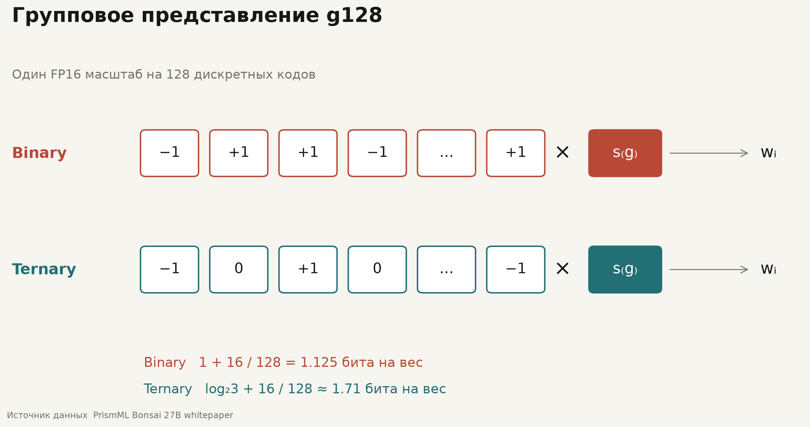
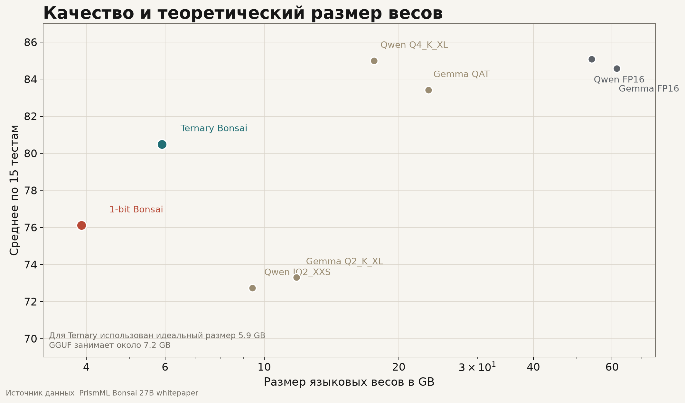
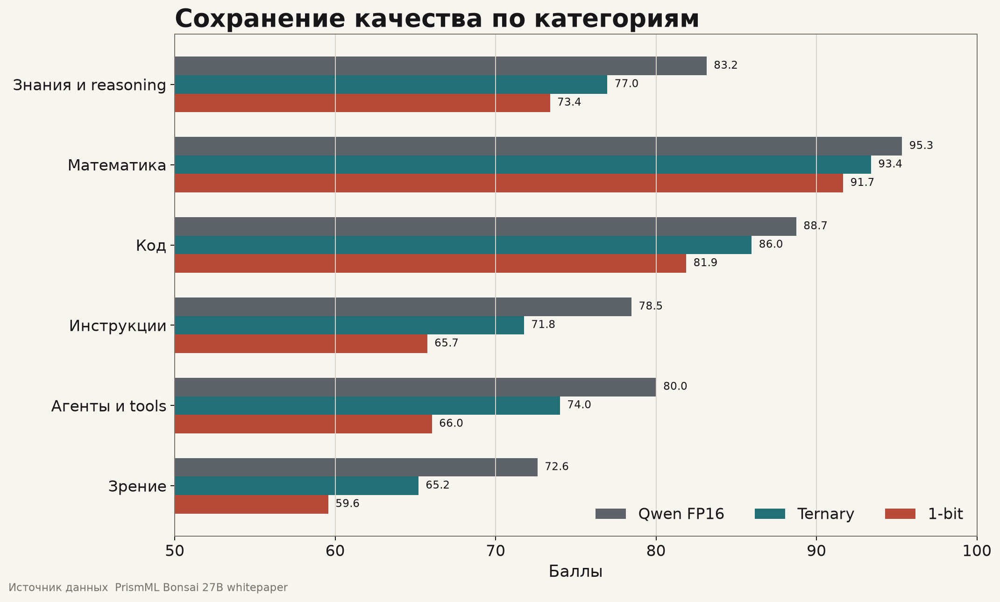

# Чуть более детально о Bonsai 27b

Дополнение к посту о бинарной и тернарной версиях модели PrismML

Версия от 28 июля 2026 года

В посте я объяснил устройство Bonsai 27B через несколько упрощений. Здесь разберу, что именно я упростил и как все устроено на техническом уровне. В качестве источников использую [технический отчет Bonsai 27B](https://github.com/PrismML-Eng/Bonsai-demo/blob/main/bonsai-27b-whitepaper.pdf), карточки моделей и опубликованные файлы весов.

## TL;DR

PrismML взяла готовую Qwen3.6-27B и перевела основные языковые матрицы модели в бинарное или тернарное представление. Бинарная версия занимает около 3,9 ГБ, тернарный GGUF-файл около 7,2 ГБ, исходная модель в FP16 около 54 ГБ.

Название однобитная относится к основным весам Bonsai. На каждую группу из 128 низкобитных значений приходится коэффициент масштаба в FP16. Нормализации, активации, промежуточные вычисления и отдельные компоненты используют более высокую точность.

Значения 89,5 и 94,6 процента получены делением среднего результата Bonsai на средний результат исходной Qwen в наборе тестов PrismML. Эти числа относятся к конкретной оценке компании и не описывают качество модели в каждой возможной задаче.

## Почему я приравнял веса к параметрам

> "Для простоты нашего понимания скажу вот что, веса = параметры"

Тут я намеренно поставил между двумя понятиями знак равенства, чтобы не перегружать пост терминологией. В посте речь шла о размере файла, где основной объем приходится на большие матрицы весов. В параметры Qwen3.6-27B помимо прочего входят матрицы эмбеддингов, `q_proj`, `k_proj`, `v_proj`, `o_proj`, `gate_proj`, `up_proj`, `down_proj`, параметры Gated DeltaNet, `lm_head`, коэффициенты нормализации и другие обучаемые тензоры масштаба и смещения

## Что я имел в виду под количеством весов

> "Чем больше весов, тем больше информации и сложных закономерностей модель потенциально способна усвоить"

Дополнительные параметры дают модели больше пространства для усвоения сложных зависимостей. Итоговое качество также определяется обучающими данными, архитектурой и самим процессом обучения

Недавно, кстати, вышла ornith-1.0 9b, которая своими некоторыми возможностями составляет конкуренцию даже моделям класса сильно выше, где кратно больше параметров.

## Как я описал преобразование Qwen3.6-27B

> "Они научились ещё на этапе дообучения закладывать в модель то, что она будет работать в режиме экстремального сжатия"

Тут я свел весь процесс к идее адаптации модели под низкую точность. Технически PrismML берет готовую Qwen3.6-27B, сохраняет ее архитектуру и преобразует основные языковые веса в бинарное или тернарное пространство. Затем значения весов настраиваются с учетом этого ограничения, чтобы поведение модели осталось близким к исходной версии, саму архитектуру Qwen при этом не переделывают. Изменения относятся к представлению и настройке весов, а также к среде выполнения, которая умеет работать с ними напрямую. Я бы очень хотел посмотреть точный алгоритм, но его, к моему сожалению, по-просту нет

## Что я опустил в объяснении бинарных и тернарных весов

> "В бинарной Bonsai каждый основной вес может принимать одно из двух значений −1 или +1, а в тернарной добавляется третье значение 0"

В бинарной версии для каждого основного веса хранится одно из двух состояний:

$$
b_i \in \{-1,+1\}
$$

В тернарной версии состояний три:

$$
t_i \in \{-1,0,+1\}
$$

Фактическая величина веса определяется еще и коэффициентом масштаба. Одна группа из 128 кодов получает общий коэффициент $s_g$ в FP16. Во время вычисления вес принимает значение

$$
w_i=s_g b_i
$$

или

$$
w_i=s_g t_i
$$

> "для каждой их группы добавляя отдельный коэффициент масштаба и для 128 весов модели Bonsai-27b он свой"

Например, при коэффициенте 0,03 бинарные веса группы принимают значения −0,03 и +0,03. В тернарной версии появляется третье значение 0. За счет общего коэффициента разные группы сохраняют свой диапазон величин.

## Откуда я взял размеры 3,9 и 7,2 ГБ

> "3,9 и 7,2 ГБ против исходных 54 ГБ"

В бинарной версии один код занимает 1 бит. Коэффициент FP16 добавляет еще 16 бит на каждые 128 весов:

$$
1+\frac{16}{128}=1{,}125 \text{ бита на вес}
$$

По отношению к FP16 это дает сжатие примерно в 14,2 раза и расчетный размер около 3,9 ГБ.

Тернарное значение несет $\log_2 3$ бита информации. С учетом коэффициента масштаба получается около 1,71 бита на вес и 5,9 ГБ для всего представления. В текущем GGUF каждый тернарный код занимает двухбитную ячейку, из-за чего опубликованный файл весит около 7,2 ГБ.

| Версия | Битов на вес | Расчетный размер | Размер GGUF-файла |
|---|---:|---:|---:|
| Qwen3.6-27B FP16 | 16 | около 54 ГБ | около 54 ГБ |
| Binary Bonsai g128 | 1,125 | около 3,9 ГБ | около 3,9 ГБ |
| Ternary Bonsai g128 | около 1,71 | около 5,9 ГБ | около 7,2 ГБ |

В посте я указал размеры файлов, которые можно скачать

## Что я имел в виду под полной точностью

> "столь ужатую точность имеют не все компоненты модели, часть всё равно будет иметь полную точность"

Этой фразой я отделил бинарные и тернарные языковые веса от остальных компонентов. Низкобитное представление получают крупные языковые матрицы:

- матрицы эмбеддингов
- проекции механизма внимания
- проекции многослойного перцептрона
- выходная матрица языковой модели

Коэффициенты масштаба хранятся в FP16. Нормализации, активации и чувствительные этапы накопления используют более высокую точность. Зрительная часть сжата отдельно до 4 бит. KV-кэш работает в FP16 или в отдельном 4-битном режиме. Слово однобитная в названии Bonsai относится к основным языковым весам. 

## Как получились 89,5 и 94,6 процента

> "Так как именно prismML нам демонстрирует сохранение 89,5% и 94,6% исходного \"качества\" исходной полноточной модели?"

PrismML проверила модели на 15 тестах и посчитала невзвешенное среднее результатов. Исходная Qwen3.6-27B в FP16 получила 85,07 балла, тернарная Bonsai 80,49, бинарная 76,11.

Проценты рассчитаны делением средних результатов:

$$
\frac{80{,}49}{85{,}07}=94{,}6\%
$$

$$
\frac{76{,}11}{85{,}07}=89{,}5\%
$$

| Модель | Размер | Средний результат | От результата FP16 |
|---|---:|---:|---:|
| Qwen3.6-27B FP16 | около 54 ГБ | 85,07 | 100 процентов |
| Ternary Bonsai 27B | 5,9 ГБ в расчетном представлении | 80,49 | 94,6 процента |
| Binary Bonsai 27B | около 3,9 ГБ | 76,11 | 89,5 процента |

В посте я взял эти значения в кавычки, потому что единицы качества модели здесь нет. Проценты показывают отношение двух средних результатов в конкретном наборе тестов. По отдельным категориям потери различаются. Математика и программирование пострадали меньше, выполнение инструкций, работа с инструментами и обработка изображений — заметнее. 

Для исходной Qwen PrismML использовала температуру 1,0, для Bonsai — 0,7. Эти настройки соответствуют рекомендациям для каждой модели. Все результаты получила сама PrismML, поэтому числа 89,5 и 94,6 процента я отношу именно к ней 

## Почему я назвал результат прорывом

> "PrismML удалось ужать 27-миллиардную модель почти в 14 раз, сохранив большую часть ее возможностей"

Почти 14 раз получились из сравнения 1,125 бита на основной вес с 16 битами в FP16. Сохранение возможностей я описал через средний результат бинарной версии, который составил 89,5 процента от исходной модели в тестах PrismML. Бинарные и тернарные нейронные сети существовали и раньше. В Bonsai меня впечатлил конкретный инженерный результат: PrismML взяла уже обученную модель класса 27B, сохранила ее архитектуру, опубликовала низкобитные веса и реализовала их прямой запуск в MLX и `llama.cpp`. Ну и само качество получившейся модели, с учётом её конечного размера и требований к железу

## Источники

- [Технический отчет Bonsai 27B](https://github.com/PrismML-Eng/Bonsai-demo/blob/main/bonsai-27b-whitepaper.pdf)
- [Демонстрационный репозиторий и инструкции по запуску](https://github.com/PrismML-Eng/Bonsai-demo)
- [Binary Bonsai 27B GGUF](https://huggingface.co/prism-ml/Bonsai-27B-gguf)
- [Ternary Bonsai 27B GGUF](https://huggingface.co/prism-ml/Ternary-Bonsai-27B-gguf)
- [Карточка Qwen3.6-27B](https://huggingface.co/Qwen/Qwen3.6-27B)
- [Объявление PrismML](https://prismml.com/news/bonsai-27b)
- [Инструкция по локальному запуску](https://gist.github.com/necrasov-ilya/12534060ce65132fbfa7444791ff5966)
